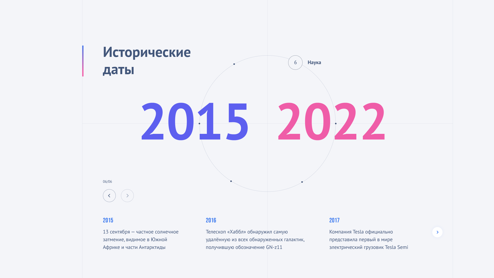

# Timeline Block Component



## Описание

Проект - это тестовое задание с использованием анимаций GSAP. Нужно реализовать блок с временными отрезками, в каждом из которых существует несколько событий.
При переключении временных отрезков изменяются соответствующие числа и под ними показывается новый слайдер, который содержит подробную информацию по ключевым событиям на активном временном отрезке.

Проект можно посмотреть по [ссылке](https://frontend-only-phi.vercel.app/)

## Технологии и библиотеки

- **TypeScript**
- **React.js**
- **styled-components**
- **Webpack**
- **Swiper** для слайдера
- **GSAP** для анимаций

## Установка

1. Клонируйте репозиторий и установите зависимости:

   ```bash
   git clone git@github.com:CHaPiOn777/frontend-only.git
   cd frontend-only
   npm install

   ```

2. Запустите локально проект

```bash
npm run start
```

3. Откройте в браузере [http://localhost:3000](http://localhost:3000)
